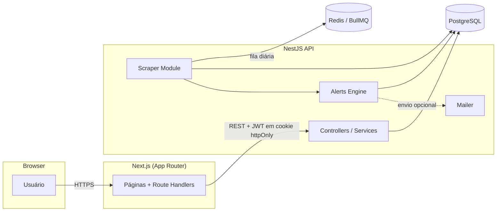

<div align="center">

# Central de Editais Públicos

**SaaS de monitoramento de licitações e editais públicos** — cadastre filtros por cidade, categoria e
palavra-chave e receba alertas automáticos assim que surgir uma oportunidade compatível.

[](https://nodejs.org)
[](https://nestjs.com)
[](https://nextjs.org)
[](https://www.typescriptlang.org)
[](https://www.postgresql.org)
[](https://www.prisma.io)
[](https://redis.io)
[](https://www.docker.com)
[](LICENSE)

</div>

---

## O problema

> Muitas empresas perdem oportunidades em licitações porque não acompanham editais diariamente.

Pequenas empresas e prestadores de serviço que vendem para o setor público raramente têm tempo de vasculhar
dezenas de portais de prefeituras, governos estaduais e diários oficiais todos os dias. Resultado: prazos perdidos
e oportunidades que nunca chegam a ser vistas.

A **Central de Editais Públicos** resolve isso: você cadastra o que te interessa uma vez, e a plataforma avisa
quando algo compatível aparece.

## Funcionalidades

| Área | O que faz |
|---|---|
| **Autenticação** | Cadastro, login, logout e perfil com JWT; rotas do painel protegidas por middleware |
| **Filtros de interesse** | Cidade, estado, categoria, palavra-chave, órgão, modalidade e faixa de valor |
| **Editais** | Listagem com busca e filtros, detalhe completo, favoritos |
| **Robô de busca** | Roda diariamente (cron + fila BullMQ), simula a chegada de novos editais, deduplica e loga cada execução |
| **Alertas automáticos** | Motor de matching compara todo novo edital com os filtros de cada usuário e cria o alerta no painel (e por e-mail no plano Premium) |
| **Dashboard** | Totais, editais perto do prazo, últimos encontrados, logs do robô |
| **Planos** | Gratuito (limites) x Premium (ilimitado), com os limites vindos do banco — não do código |

## Arquitetura



O frontend nunca fala direto com o banco: todo dado passa pela API Nest. O robô roda sobre uma interface
`ScraperSourceProvider` plugável — hoje só existe um provider mock, mas integrar o Portal Nacional de Contratações
Públicas ou um diário oficial real é só implementar a interface e registrar no `ScraperModule`.

## Stack

- **Backend**: NestJS, Prisma ORM, PostgreSQL, BullMQ + Redis, Passport/JWT, Swagger, Nodemailer
- **Frontend**: Next.js (App Router), TypeScript, Tailwind CSS, React Hook Form + Zod
- **Infra**: Docker Compose (Postgres, Redis, backend, frontend)

## Como rodar

Pré-requisitos: Docker e Docker Compose.

```bash
git clone <url-deste-repositorio>
cd central-editais-publicos
cp .env.example .env
docker compose up --build
```

| Serviço  | URL |
|----------|-----|
| Frontend | http://localhost:3000 |
| Backend  | http://localhost:4000/api |
| Swagger  | http://localhost:4000/docs |

O backend aplica as migrations e roda o seed automaticamente na primeira subida (2 planos, 1 usuário de
demonstração e ~18 editais fictícios).

**Conta de demonstração**: `demo@centraldeeditais.com.br` / `senha123`

No Dashboard existe um botão **"Simular busca diária agora"**, que dispara na hora o mesmo pipeline do robô
(fila → geração de editais → deduplicação → gravação → motor de alertas → log), sem precisar esperar o cron.

## Planos

| Regra | Gratuito | Premium |
|---|---|---|
| Filtros de interesse | até 3 | ilimitado |
| Favoritos | até 8 | ilimitado |
| Resultados na lista de editais | até 20 | ilimitado |
| Alertas por e-mail | não | sim |

Cobrança não está integrada nesta versão (MVP) — a página `/planos` já está pronta para receber um provedor de
pagamento no futuro.

## Estrutura do projeto

```
backend/    API NestJS (auth, editais, filtros, favoritos, alertas, robô, dashboard)
frontend/   Next.js App Router (landing, autenticação, painel logado)
docker-compose.yml
.env.example
```

## Roadmap

- [ ] Integração com fontes reais de editais (PNCP, diários oficiais, portais estaduais/municipais)
- [ ] Cobrança do plano Premium
- [ ] Envio de e-mail real configurável via UI
- [ ] Testes automatizados (unit + e2e)

## Licença

Distribuído sob a licença MIT. Veja [LICENSE](LICENSE).

---

<div align="center">
<sub>Projeto de demonstração (MVP) — todos os editais são fictícios, gerados por um robô mock. Nenhum dado real ou sensível é usado.</sub>
</div>
